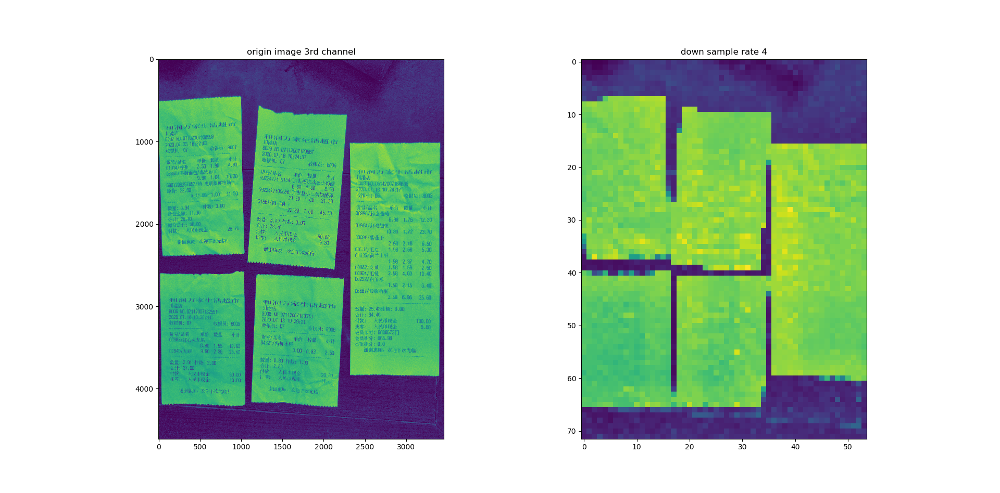
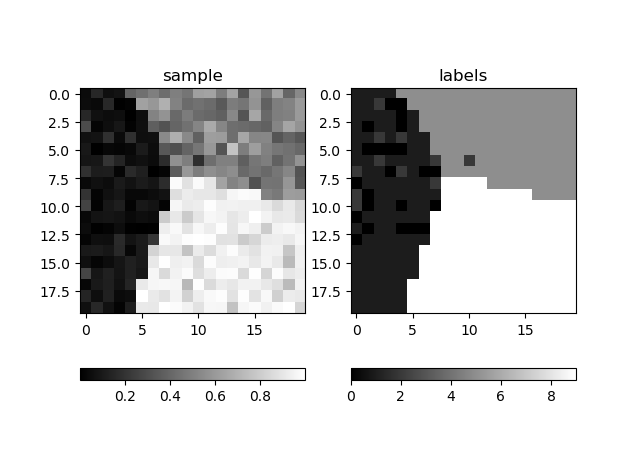

# ncut instance segmentation

## ncut of 2 partitions and 3 partitions


## mobile phone photo segmentation


### recuresive 2 way partition
```
python recipt_seg.py
```


## edge line segmentation
``` python anisodiff2D.py ```


## edge detection


## pixel label


