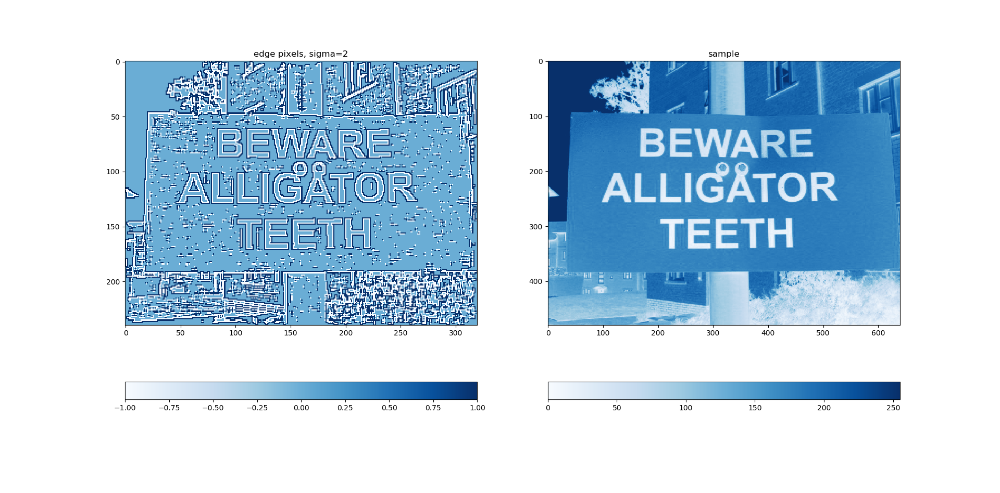
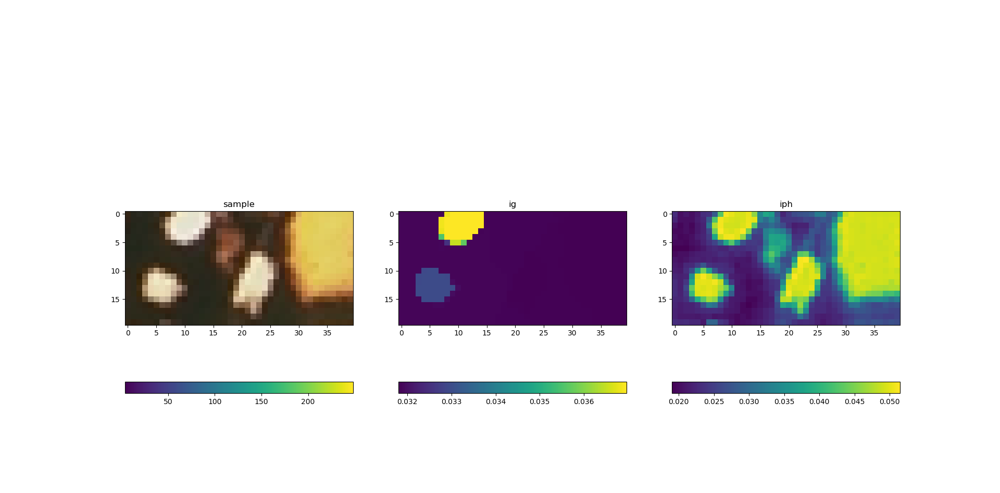

# ncut instance segmentation

## ncut of 2 partitions and 3 partitions
`segment.py`


### recuresive 2 way partition
```
python recipt_seg.py
```


## edge segmentation
``` python anisodiff2D.py ```


## edge detection


## pixel label


## ncut
`cluster.py`



## Ref

1. Jianbo Shi and J. Malik. Normalized cuts and image segmentation. IEEE Transactions on Pattern Analysis.
2. Yizong Cheng. Mean shift, mode seeking, and clustering. IEEE transactions on pattern analysis and machine
intelligence, 17(8):790–799, 1995.
3. Lowe D G. Distinctive image features from scale-invariant keypoints[J]. International journal of computer vision, 2004, 60(2): 91-110.
