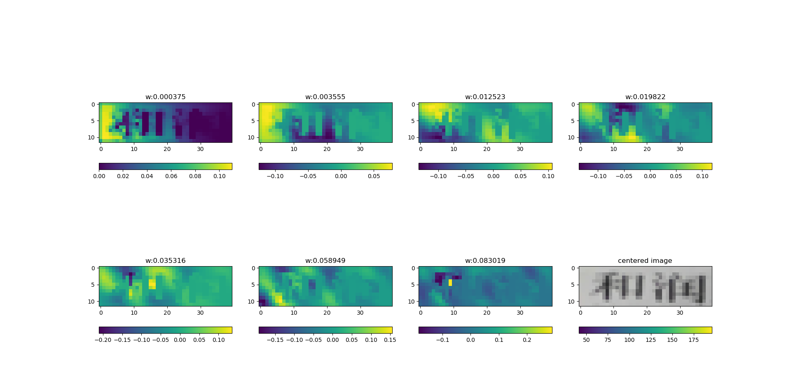

# ncut instance segmentation

## ncut
ncut with eigensolver Lanczos `segment.py`

## edge detection

## pixel label
`cluster.py`

### binary label
`ms_bina.py`

## Ref

1. Jianbo Shi and J. Malik. Normalized cuts and image segmentation. IEEE Transactions on Pattern Analysis.
2. Yizong Cheng. Mean shift, mode seeking, and clustering. IEEE transactions on pattern analysis and machine
intelligence, 17(8):790–799, 1995.
3. Lowe D G. Distinctive image features from scale-invariant keypoints[J]. International journal of computer vision, 2004, 60(2): 91-110.
